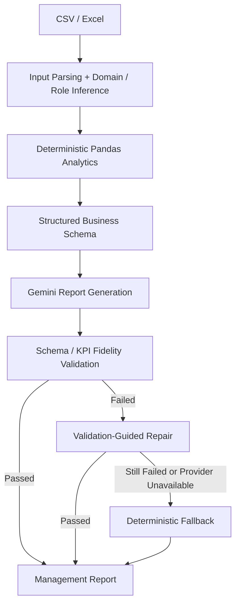

# Business Insight Copilot

A Streamlit-based AI analytics application that combines deterministic business KPI analysis with Gemini-generated management reports, validation-guided repair, and deterministic fallback across Retail, SaaS, and Logistics scenarios.

## Key capabilities

- Deterministic Retail, SaaS, and Logistics KPI analysis with Pandas
- Domain-aware KPI cards, management charts, segments, trends, correlations, and risks
- Current-snapshot SaaS MRR/ARR semantics and operational Logistics metrics
- Gemini-generated management reports from structured summaries rather than full datasets
- Markdown/schema validation and selected critical-KPI fidelity checks
- One validation-guided repair attempt followed by deterministic local fallback
- Persistent Streamlit workflow state across page navigation
- Bilingual English/Chinese UI with independent report-language selection
- Reproducible offline three-domain evaluation and 98 deterministic tests

## Architecture



Python and Pandas remain the source of truth for calculated metrics. Gemini receives compact structured summaries and produces the management narrative. Validation accepts supported labels and equivalent numeric formatting while rejecting genuine drift in selected critical KPIs.

## Product workflow

1. **Data Overview** — upload CSV/Excel data, review quality, detected domain, and field mapping.
2. **Business Analytics** — inspect domain KPIs, business charts, segment comparisons, trends, correlations, and risks.
3. **AI Management Report** — generate a structured report and review its source, validation, KPI-fidelity, and fallback status.

The application supports Chinese and English reports with:

- Executive Summary
- KPI Snapshot
- Key Insights & Evidence
- Segment Analysis
- Root-Cause Hypotheses
- Recommended Actions
- Data Limitations

## Supported scenarios

| Domain | Representative analytics |
| --- | --- |
| Retail | Sales, profit, margin, discount exposure, loss records, category/region contribution |
| SaaS | Current MRR/ARR, MRR growth, churn, expansion revenue, plan and customer-segment comparison |
| Logistics | Shipment volume, delay/damage rates, delivery time, shipping-cost ratio, carrier/region performance |

Synthetic sample datasets are available in `data/sample/`.

## Reliability design

The report pipeline separates deterministic analysis from LLM presentation:

- The report schema contains computed KPIs, evidence, hypotheses, actions, and limitations.
- Critical-KPI validation checks a selected domain-specific set rather than claiming complete fact verification.
- Equivalent formats such as `0.4722` and `47.22%` are normalized for supported percentage KPIs.
- Explicit supported KPI aliases are accepted; genuine KPI drift is rejected.
- Invalid output receives one guided repair attempt.
- A failed repair or unavailable provider produces a deterministic local report.

### Validation-guided repair


### Deterministic local fallback


These are existing reliability-path screenshots. Primary product screenshots should be captured from the final interface before publication.

## Offline evaluation

The repository includes a reproducible offline evaluation over three synthetic fixtures. It is a project regression suite, not a production benchmark.

| Domain | KPI correctness | Report structure | Reliability/fallback | Evidence separation |
| --- | --- | --- | --- | --- |
| Retail | PASS | PASS | PASS | PASS |
| SaaS | PASS | PASS | PASS | PASS |
| Logistics | PASS | PASS | PASS | PASS |

```powershell
.\.venv\Scripts\python.exe -m evals.run_eval
```

See [docs/EVALUATION.md](docs/EVALUATION.md) for definitions and limitations.

## Run locally

```powershell
python -m venv .venv
.\.venv\Scripts\Activate.ps1
pip install -r requirements.txt
Copy-Item .env.example .env
```

Add your Gemini key to `.env` using the documented environment variable name, then start the application:

```powershell
.\.venv\Scripts\python.exe -m streamlit run app.py
```

## Tests

```powershell
.\.venv\Scripts\python.exe -m pytest -q
```

Current verified result: **98 passed**.

The suite covers domain detection, role inference, KPI semantics, binary-flag handling, report structure, critical-KPI fidelity, repair/fallback behavior, UI formatting helpers, workflow state persistence, and offline evaluation regressions.

## Repository structure

```text
app.py                    Streamlit workflow and presentation
agents/data_analyzer.py   Deterministic analytics and domain logic
agents/report_generator.py Structured report schema, validation, repair, fallback
utils/                    File, chart, UI, and session-state helpers
data/sample/              Synthetic Retail, SaaS, and Logistics fixtures
evals/                    Reproducible offline evaluation
tests/                    Deterministic regression tests
examples/sample_reports/  Example management reports
docs/                     Evaluation and engineering notes
assets/                   Existing reliability screenshots
```

## Limitations

- Role inference is keyword/schema based and may require manual review for unfamiliar columns.
- Deterministic domain logic targets supported Retail, SaaS, and Logistics schemas.
- Critical-KPI validation covers selected metrics; it is not complete semantic fact verification.
- Gemini is the single integrated LLM provider path.
- Evaluation uses small synthetic fixtures and does not establish production-scale reliability.
- Correlations are descriptive and do not establish causation.
- Workflow state is session scoped; there is no persistent database or report history.
