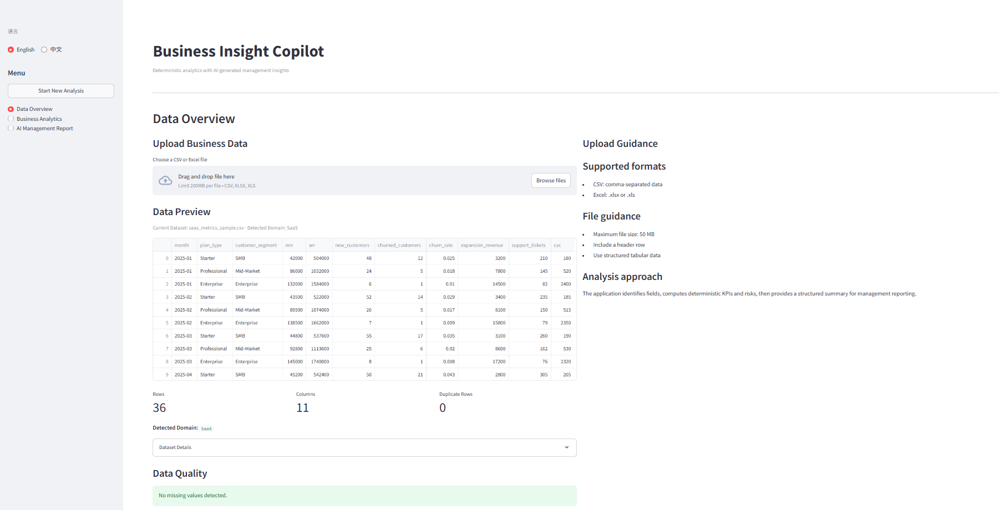
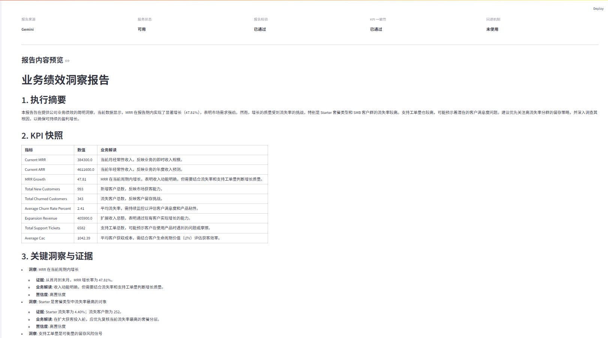
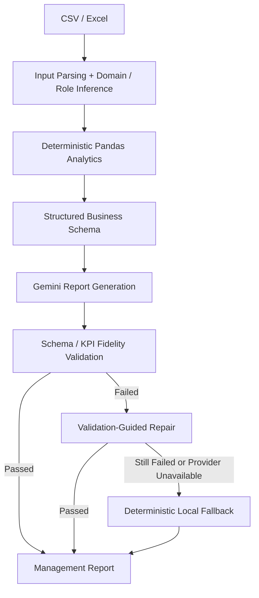
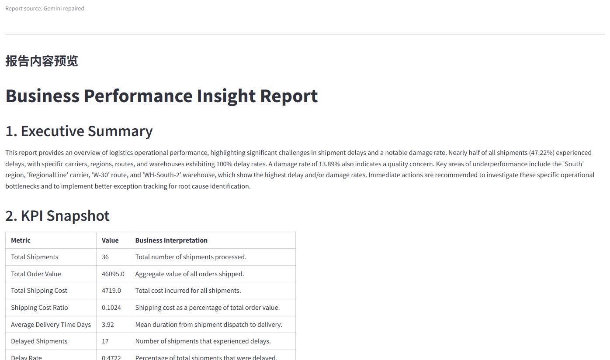
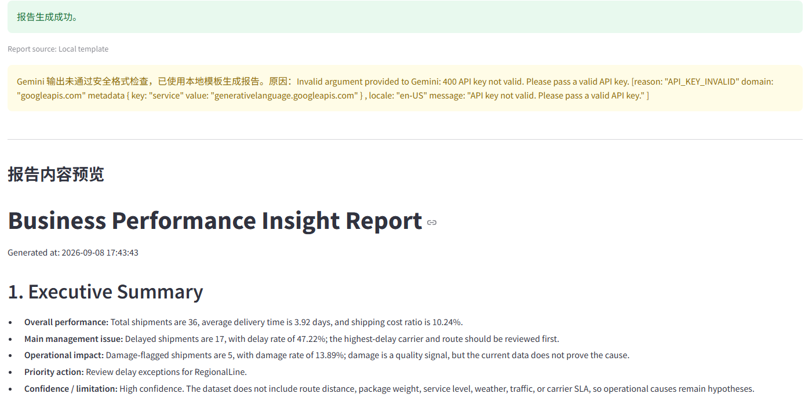
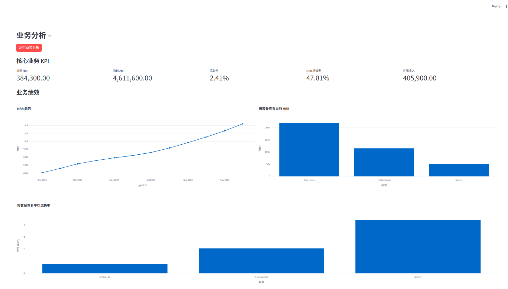
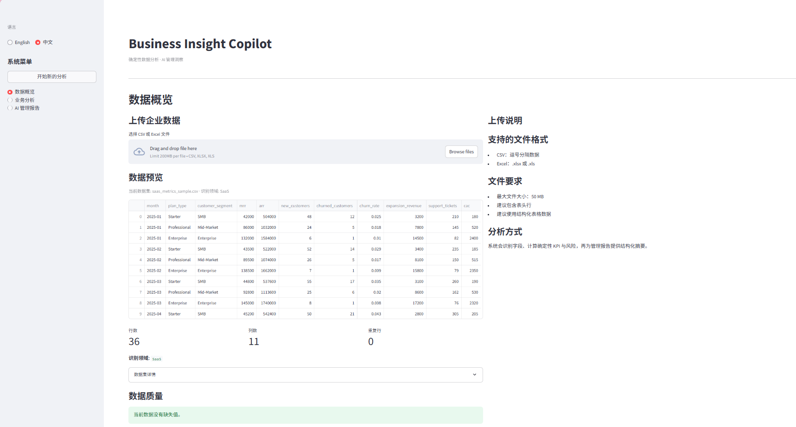

# Business Insight Copilot

> Deterministic business analytics with validated AI-generated management insights.

Business Insight Copilot turns structured business data into decision-ready analysis and management reporting. Python and Pandas compute the numerical source of truth, domain-specific analytics interpret Retail, SaaS, and Logistics data, and Gemini converts structured analytical evidence into management reports.



> Upload structured business data, detect the business domain, validate data quality, and map fields before analysis.

## Highlights

- **Deterministic domain analytics:** purpose-built KPIs, segments, trends, correlations, and risks for Retail, SaaS, and Logistics.
- **AI management reporting:** Gemini works from structured summaries and evidence; it is not the numerical source of truth.
- **Reliability by design:** Markdown/schema validation, selected critical-KPI fidelity checks, guided repair, and deterministic local fallback.
- **Bilingual workflow:** English and Chinese UI with independently configurable report language.
- **Verified behavior:** 98 deterministic tests and a reproducible offline evaluation across all three supported domains.

## Product Demo

**Data → Analytics → AI Management Report**

### Data Overview

Upload CSV or Excel data, preview the dataset, inspect row, column, and duplicate-row counts, review data quality, detect the business domain, and verify domain field mapping.

### Business Analytics

The analytics layer presents domain-specific KPIs, segment comparisons, trends, correlations, risks, and advanced data exploration. Calculations remain deterministic and use the uploaded DataFrame without renaming its source columns or values.

### AI Management Report



The report language is configurable independently from the interface language. The report view exposes Report Source, Provider Status, Report Validation, KPI Fidelity, and Fallback metadata; these checks cover report structure and selected critical KPIs rather than complete semantic verification of every claim.

## What It Analyzes

| Domain | Representative analytics |
| --- | --- |
| Retail | Sales, profit, margin, discount exposure, loss records, and category/region performance |
| SaaS | Current MRR/ARR, MRR growth, churn, expansion revenue, and plan/customer-segment performance |
| Logistics | Shipment volume, delay/damage rates, delivery time, shipping-cost ratio, and carrier/region performance |

Synthetic sample datasets are available in [`data/sample/`](data/sample/).

## Architecture



> **Design principle:** Python/Pandas compute the source-of-truth metrics; Gemini operates on structured analytical evidence rather than raw data.

## Reliability by Design

- Deterministic Python/Pandas KPI computation
- Structured report schema with evidence, hypotheses, actions, and limitations
- Markdown and schema validation
- Selected critical-KPI fidelity validation with supported aliases and numeric normalization
- One validation-guided repair attempt
- Deterministic local fallback when repair does not produce a valid report
- Provider-failure classification for rate limits and unavailable service responses

| Scenario | Behavior |
| --- | --- |
| Valid Gemini response | Accepted |
| Repairable response | Repaired and revalidated |
| KPI drift | Rejected |
| Still invalid after repair | Deterministic local fallback |
| Provider 429 / 503 | Provider failure classified and local fallback used |

### Validation-Guided Repair



An initially invalid Gemini response receives one guided repair attempt and is accepted only after revalidation succeeds.

### Deterministic Local Fallback



When provider generation is unavailable or repaired output remains invalid, the application renders a deterministic report from the structured analytical schema.

## Bilingual Experience

The interface supports English and 中文. Report Language independently supports **Follow UI**, **English**, and **中文**. Changing the UI language preserves uploaded data, analytics results, and existing reports; it does not regenerate or translate report content. Internal IDs, KPI keys, DataFrame columns, chart keys, and widget keys remain language-independent.

### Chinese Business Analytics



> Domain KPIs, charts, analytical tabs, and risk context rendered in Chinese.

### Chinese Data Overview



> The localized overview preserves the same dataset, field mapping, and deterministic workflow state.

## Offline Evaluation

The repository includes a reproducible project regression suite over three small synthetic fixtures. It is not a production benchmark and does not measure general model quality.

| Domain | KPI correctness | Report structure | Reliability/fallback | Evidence separation |
| --- | --- | --- | --- | --- |
| Retail | PASS | PASS | PASS | PASS |
| SaaS | PASS | PASS | PASS | PASS |
| Logistics | PASS | PASS | PASS | PASS |

Run it locally:

```powershell
.\.venv\Scripts\python.exe -m evals.run_eval
```

See [`docs/EVALUATION.md`](docs/EVALUATION.md) for metric definitions, methodology, and limitations.

## Tech Stack

- Python
- Pandas
- Streamlit
- Plotly
- Google Gemini
- pytest

## Run Locally

```powershell
python -m venv .venv
.\.venv\Scripts\Activate.ps1
pip install -r requirements.txt
Copy-Item .env.example .env
```

Add your Gemini key to `.env` using the variable documented in `.env.example`, then start the application:

```powershell
.\.venv\Scripts\python.exe -m streamlit run app.py
```

## Tests

```powershell
.\.venv\Scripts\python.exe -m pytest -q
```

Current verified result: **98 passed**.

Representative coverage includes domain detection, field-role inference, KPI semantics, report validation, selected KPI fidelity, repair/fallback behavior, localization, Streamlit session-state lifecycle, UI helpers, and offline evaluation regressions.

## Repository Structure

```text
data-analysis-agent/
├── app.py          # Streamlit workflow and presentation
├── agents/         # Deterministic analytics and report generation
├── utils/          # i18n, session state, charts, and file/UI helpers
├── data/sample/    # Synthetic Retail, SaaS, and Logistics fixtures
├── evals/          # Reproducible offline evaluation
├── tests/          # Deterministic regression suite
├── assets/         # Product and reliability screenshots
└── docs/           # Evaluation and engineering documentation
```

## Limitations

- Field and role inference is keyword/schema based and may require manual review for unfamiliar columns.
- Deterministic domain logic targets supported Retail, SaaS, and Logistics structures.
- Critical-KPI fidelity checks cover selected metrics only and do not constitute complete semantic fact verification.
- Gemini is the single integrated LLM provider.
- Evaluation uses small synthetic fixtures and does not establish production-scale reliability.
- Correlations are descriptive and do not establish causation.
- Streamlit workflow state is session scoped; there is no persistent report history or database.
